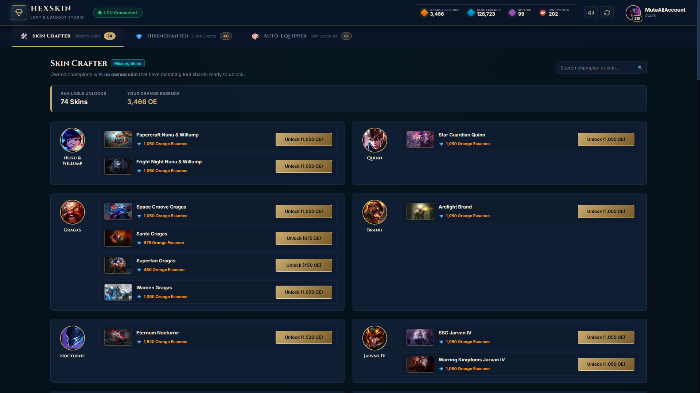
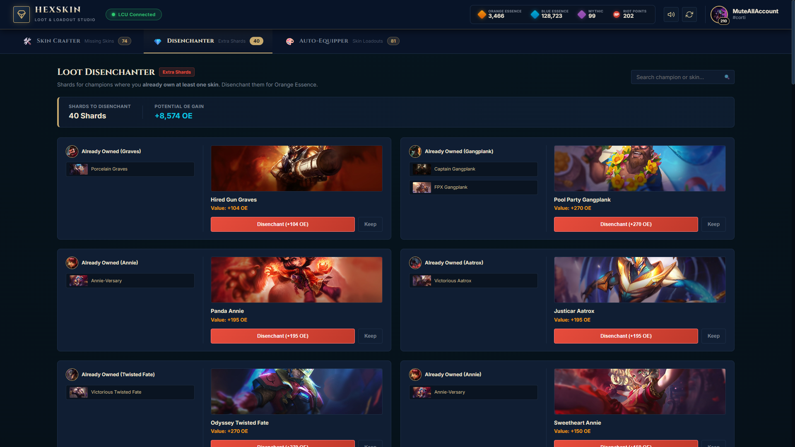
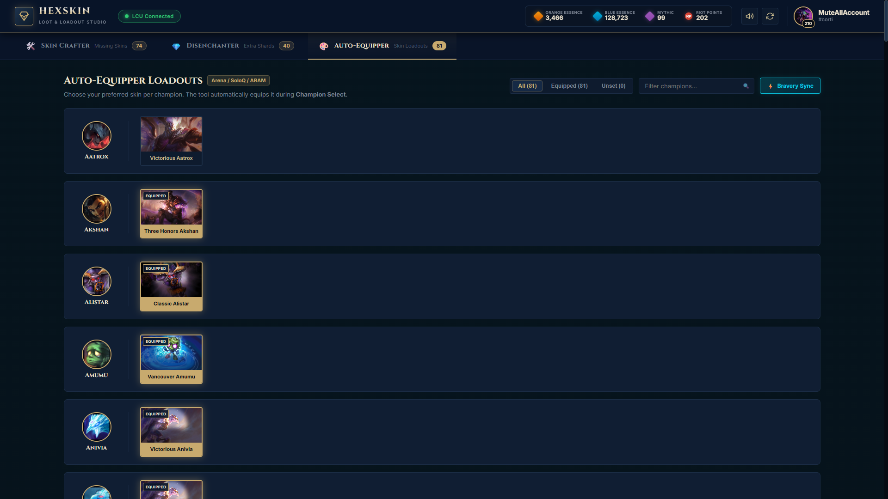
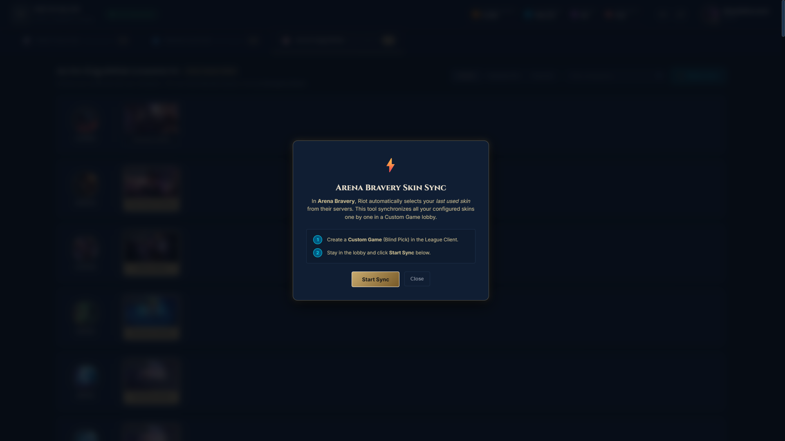

<div align="center">
  <h1>💎 HexSkin Studio</h1>
  <p><strong>LoL Loot Crafter, Disenchanter, Auto-Equipper & Arena Bravery Synchronizer</strong></p>

  <p>
    
    
    
    
    
  </p>
</div>

---

## 🌟 Overview

**HexSkin Studio** is a unified, Hextech-themed single-page web dashboard designed to manage and optimize your League of Legends skin collection, loot crafting, and champ-select skin automation.

It combines intelligent loot crafting, bulk disenchanting, real-time champion select auto-equipping, and an automated solution for **League Arena Bravery skin selection**.

---

## 📸 Screenshots

### 🛠️ 1. Skin Crafter (Missing Skins)
> Finds all owned champions where you **own 0 skins** and allows you to unlock them with Orange Essence in 1 click.


---

### 💎 2. Smart Disenchanter (Extra Shards)
> Identifies loot shards for champions where you **already own at least one skin**, letting you safely disenchant duplicates for maximum Orange Essence gain.


---

### 🎨 3. Auto-Equipper Loadouts
> Select your favorite skin for any champion. A lightweight background listener automatically equips your chosen skin during Champion Select across SoloQ, ARAM, Normal, and Arena.


---

### ⚡ 4. Arena Bravery Skin Sync
> In **Arena Bravery**, Riot server-side locks champions instantly, defaulting to your *last used skin*. This automated tool creates a quick custom lobby loop that locks in and selects all your configured favorite skins on Riot's backend account database in under 2 minutes.


---

## ✨ Features

- **Dynamic Recipe Checking**: Queries `GET /lol-loot/v1/recipes/initial-item/{loot_id}` to dynamically verify recipe slot requirements (e.g. 2-slot `[loot_id, "CURRENCY_cosmetic"]` for upgrades and 1-slot `[loot_id]` for disenchanting).
- **Real-Time Auto-Equipper**: Seamless background thread polling `GET /lol-champ-select/v1/session` to auto-equip your saved skin preference when locking in a champion.
- **Arena Bravery 1-Click Sync**: Fully automated Custom Game loop (`POST /lol-lobby/v1/lobby/custom/start-champ-select` & `cancel-champ-select`) to persist preferred skins across Riot's servers for Bravery picks.
- **Live Hextech Header**: Real-time display of summoner level, icon, and wallet balances (**Orange Essence**, **Blue Essence**, **Mythic Essence**, and **RP**).
- **Audio Feedback**: Optional toggleable Hextech sound alerts when a skin is automatically equipped.

---

## 🛡️ Anti-Cheat & Vanguard Safety

- **100% Safe & Not Bannable**: HexSkin Studio interacts exclusively with the local **League Client Update (LCU) HTTPS/WAMP REST API** running on `127.0.0.1`.
- **Zero Game Memory Modification**: It **never** reads, writes, or injects code into `League of Legends.exe`.
- It uses the exact same client endpoints as certified third-party companion apps such as **Blitz.gg, Porofessor, Mobalytics, and RuneBook**.

---

## 🚀 Getting Started

### Prerequisites
- Windows 10 / 11
- [Python 3.10+](https://www.python.org/downloads/)
- League of Legends client running and logged in

### Installation

1. **Clone the repository:**
   ```bash
   git clone https://github.com/zaryar/1Skin.git
   cd 1Skin
   ```

2. **Install dependencies:**
   ```bash
   pip install -r requirements.txt
   ```

3. **Launch HexSkin Studio:**
   - **Double-click:** `start_app.bat`
   - **Or run via terminal:**
     ```bash
     python app.py
     ```

4. **Open your browser:**
   Navigate to [http://127.0.0.1:5000](http://127.0.0.1:5000).

---

## ⚡ Arena Bravery Sync Usage

To synchronize your favorite skins for **Arena Bravery**:
1. Open the League of Legends client and create a **Custom Game** lobby (Blind Pick).
2. Open HexSkin Studio at `http://127.0.0.1:5000` and switch to the **Auto-Equipper** tab.
3. Click **⚡ Bravery Sync** in the top right, then click **Start Sync**.
4. Alternatively, you can run `sync_bravery.bat` or `python sync_bravery_skins.py` from your terminal.

---

## 📁 Project Structure

```
├── app.py                   # Main Flask application and background listener
├── lcu_client.py            # LCU connection manager, lockfile parser & recipe handler
├── sync_bravery_skins.py    # Automated Custom Game skin synchronizer for Arena Bravery
├── loadout.json             # Saved user skin preferences (Champion ID -> Skin ID)
├── start_app.bat            # 1-Click Windows web app launcher
├── sync_bravery.bat         # 1-Click Windows Bravery synchronizer launcher
├── requirements.txt         # Python package dependencies
├── templates/
│   └── index.html           # Single Page Application HTML markup
├── static/
│   ├── css/
│   │   └── style.css        # Hextech-themed modern responsive CSS
│   └── js/
│       └── app.js           # Client-side routing, data polling & UI state
└── docs/
    └── screenshots/         # UI showcase images
```

---

## 📄 License

Distributed under the MIT License. See `LICENSE` for more information.
